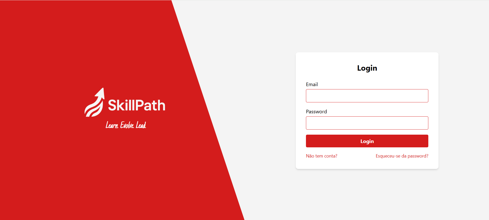
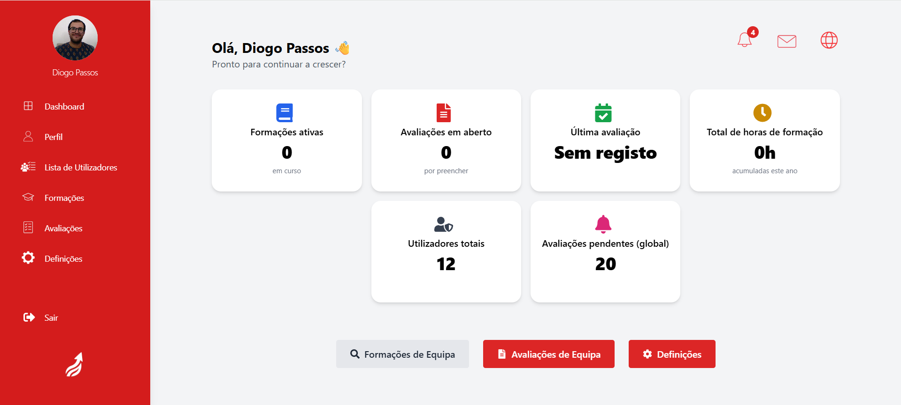
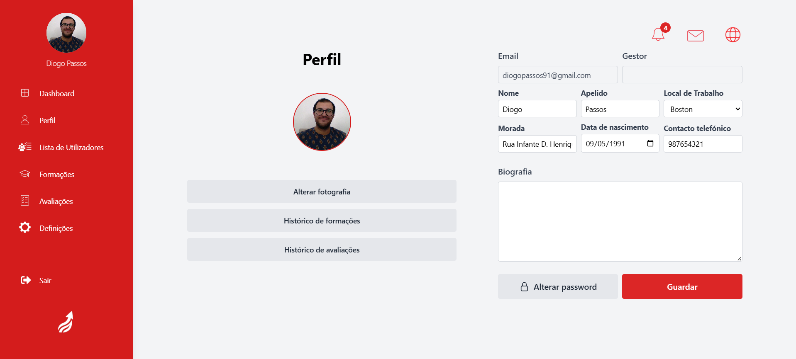

# 🚀 Employee Evaluation Management System

This repository was developed as part of the final project of the **Java Fullstack Development course (AoR - Acertar o Rumo)**, in collaboration with [Critical TechWorks](https://www.criticaltechworks.com/).

## 📋 Table of Contents

- [Introduction](#introduction)
- [Technologies Used](#technologies-used)
- [Installation](#installation)
- [Features](#features)
- [Screenshots](#screenshots)
- [Future Improvements](#future-improvements)

## 🧠 Introduction

This system was designed to support HR and management teams in the creation, evaluation, and tracking of employee assessments in a corporate context. It includes role-based access (admin, manager, employee), evaluation forms, automated notifications, and dashboards with statistics.

## 🛠️ Technologies Used

- **Backend:** Java, Java EE, RESTful APIs
- **Frontend:** React.js, Tailwind CSS
- **Database:** PostgreSQL
- **Testing:** JUnit
- **Other:** WebSockets, Zustand (state management), i18n (internationalization)

## 🖥️ Installation

To run the project locally:

1. Clone the repository:
```bash
git clone https://github.com/dpassos91/employee-evaluation-system.git
cd employee-evaluation-system

2. Set up the **PostgreSQL** database and configure credentials in `application.properties`.

3. Navigate to the `/backend` folder and run the Spring Boot application.

4. Navigate to the `/frontend` folder and start the React app:
npm install
npm run dev

5. Start the frontend and open your browser at:

https://localhost:3000

> Ensure the backend is running at:
http://localhost:8443

pgsql

> and the PostgreSQL database is correctly connected.

---

## ✅ Features

- 🔐 Secure login with session handling  
- 👤 Role-based access: Admin, Manager, User  
- 📝 Evaluation creation and score assignment  
- 👥 Reviewer delegation and form progress tracking  
- 💬 Real-time chat and notifications (WebSockets)  
- 📊 Responsive dashboard with statistics and filters  
- 🌍 Full support for multiple languages (EN, PT)  

## 📸 Screenshots

Here is a preview of the application:

  
  
                      

## 🔭 Future Improvements

- 📤 Export evaluations to PDF or Excel  
- 🔗 Integration with HR systems (e.g. BambooHR)  
- 📈 Advanced analytics and performance trends  
- ⏰ Reminder system for incomplete evaluations  

---

**Disclaimer:**  
This project was developed for educational purposes.
